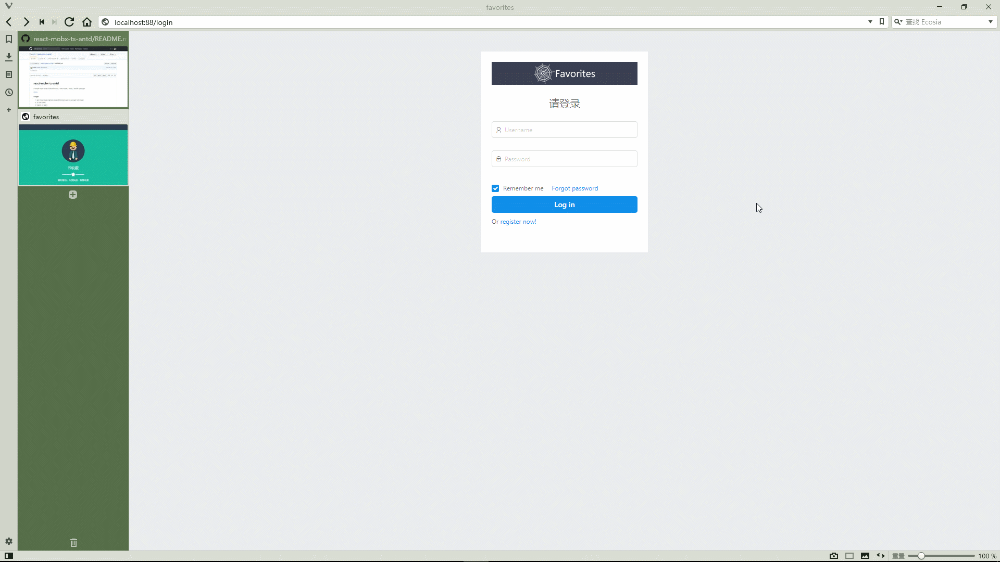
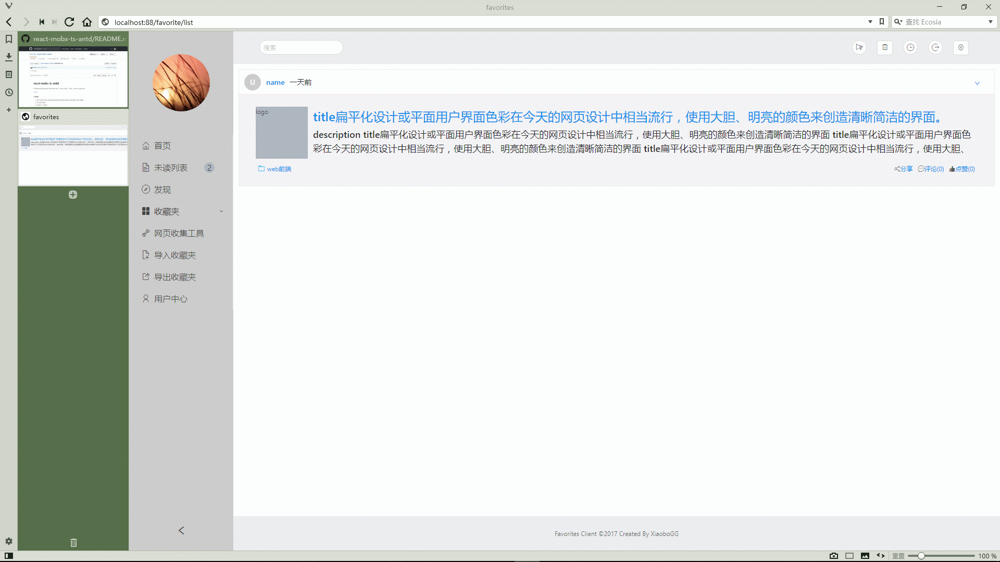
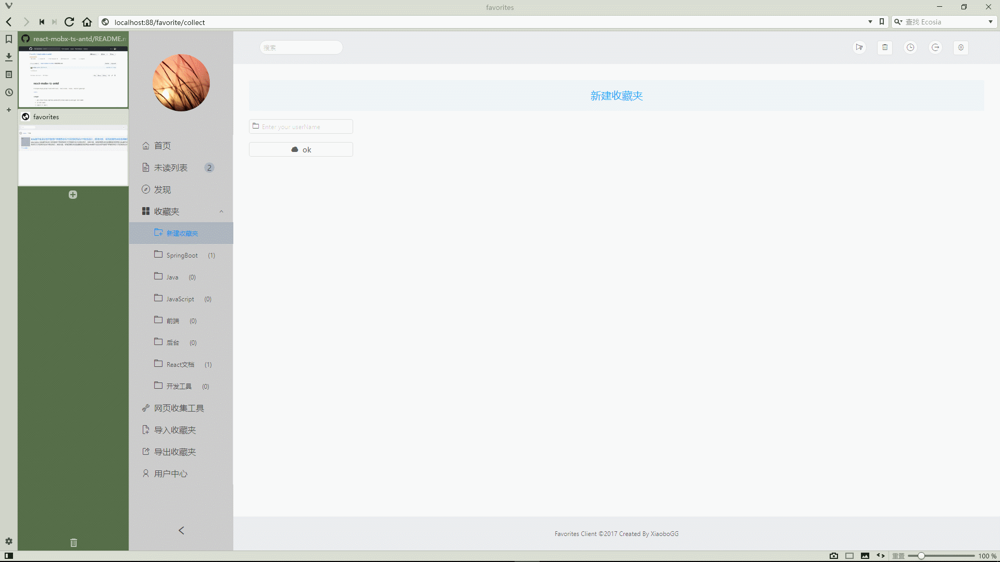
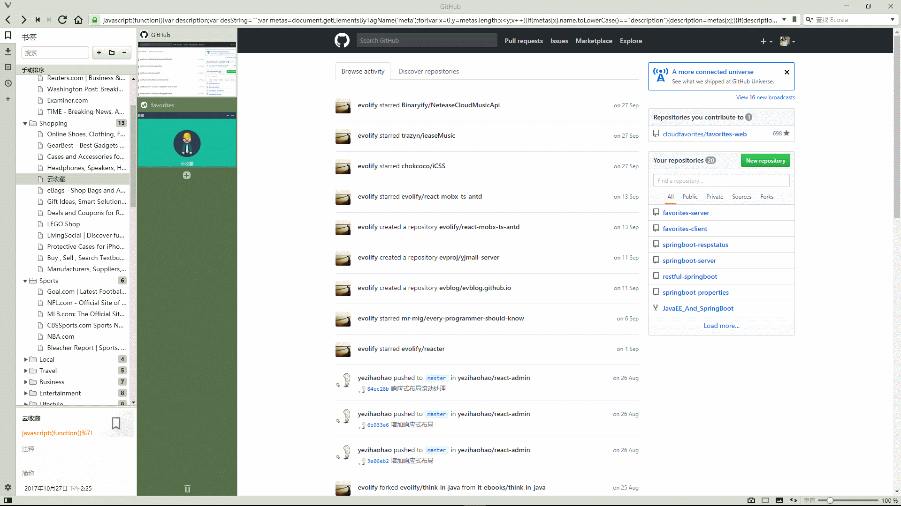

"#favorites-client" 

# 基于webpack打包的favorites项目前端代码
# 技术栈：react+react-router+react-redux+antd+axios
 
### usage：

1.	`git clone https://github.com/sxbo/favorites-client.git <dir-name>`
2.	`cd <dir-name>`
3.	`cnpm i` or `npm i`

### run in dev
  `npm run dev`
### build
  `npm run build`
  

### 部分界面效果

1.  `登录`

2.  `动画效果`

3.  `新建收藏夹`

4.  `收藏github`

## 后续完善其他功能

